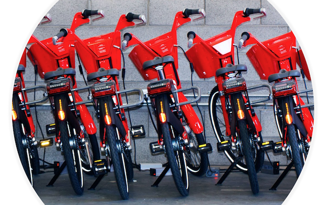
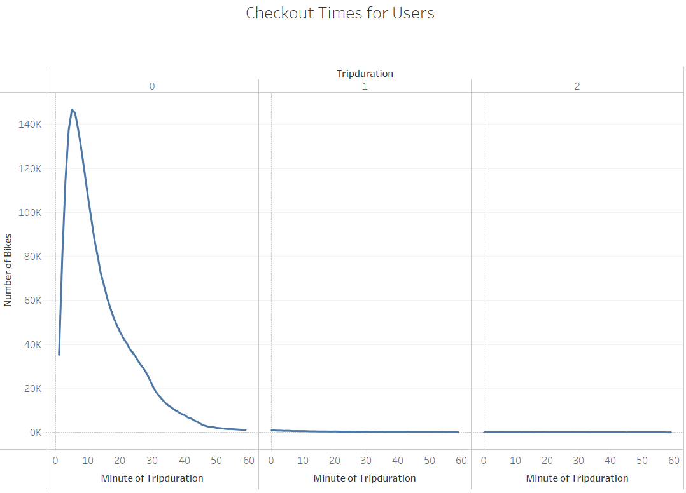
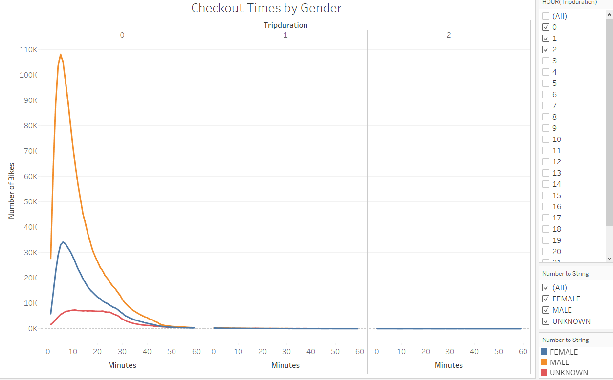
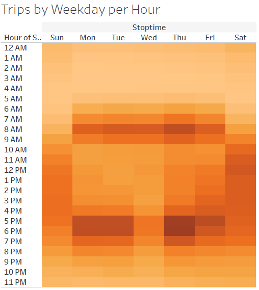
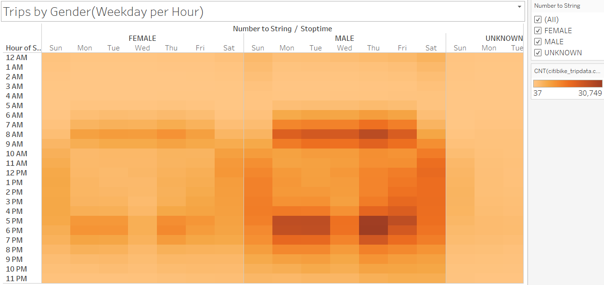
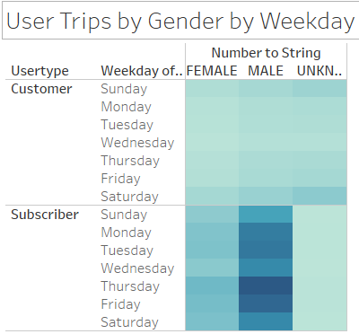

# **NYC Bikesharing Data**
## [link to dashboard](link to visualization dashboard)

(https://public.tableau.com/app/profile/irene.gonzalez1402/viz/NYCBikeshare_Challenge/BikeshareStory?publish=yes)

## After using a bikeshare in New York City, Kate wants to put together a visual presentation for investors to show how a bikeshare program could work in Des Moines, IA. Kate uses data from CitiBike for NYC for the month of August and puts together the presentation using Tableu. 

**The presentation will show:**

- The length of time that bikes are checked out for all riders and genders.

- The number of bike trips for all riders and genders for each hour of each day of the week.

- The number of bike trips for each type of user and gender for each day of the week.

## **Results**

**Checkout Times for Users**

Bikes are mostly checked out for an hour or less. The highest checkout times are between 10 and 20 minutes with 100k to 60k. 50 minutes to 1 hour has the least amount with less than 5k. 

 

**Checkout Times by Gender**

To get a better idea of who is using the bikeshare program, Kate breaks down the users by gender. The three categories are, male, female and unknown. Males are using the bikeshare the most, up to 108,087 between 10 and 20 minutes. Then females, at 34,151 for 10 minutes and unknown at 7,161 at the most for 10 minutes. 

**Trips by Weekday per Hour**

This heatmap shows the busiest days of the week by hour. Looking at the map, the busiest day is Thursday between 5pm and 6pm. Monday and Tuesday are also the busiest between the 5pm and 6pm but not busy as Thursday. 8am is the busiest hour from Monday to Friday, this is probably because this is when people are going to work. Saturday has a mildly busy day between 10 am and 7pm. 

**Trips by Gender**

To get a better idea of who would be using the bikeshare program, Kate breaks down the trips by gender. The genders are male, female, and unknown. Looking at the heatmap, it looks like the majority of users are males at 30k between 5pm and 6pm Monday, Tuesday, and Thursday. Females are the next majority users although there is a significant diffference from males. The busiest times and days for females are also, Monday, Tuesday, and Thursday between 5pm and 6pm; however, the number of users is between 7k and 11k. The least are unknown, at 5k on Saturday between 10 am and 7pm. 

**User Trips by Gender by Weekday**

To find out if the bikeshare will be used by customers, which is more on a temporary basis or by subscribers, which is more permanent, the trips are broken down by customer and subscriber and gender per weekday. It looks like there are more subscribers than customers. As shown in the previous maps, males make up the majority of the subscribers, then femailes and there are no unknow subscribers. There are however, more unknown gender customers. 

##**Summary**

After doing an analysis on the New York CitiBike share, it looks like the majority of users are male subscribers. The need for bikeshare is beneficial in a city like New York because it serves as in alternative to public transportation. Based on the days and times of day, most of the bikeshare is used for getting to and from work since peak times were during rush hour. 

**Additional Analysis**
Further analysis could be done to see what the affect weather has on bikesharing use, particularly during winter. 
Also, a comparison of how many times a bike needs repairing before it needs to be replaced. 